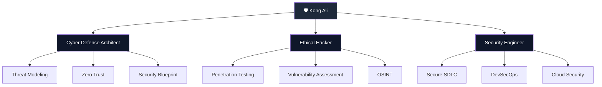
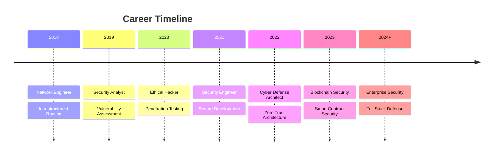
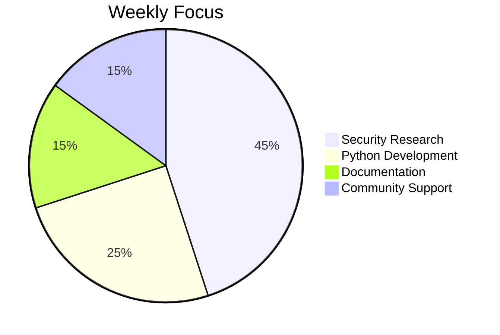
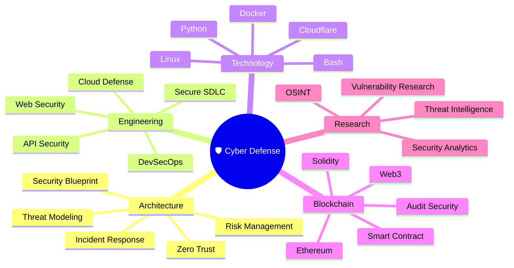
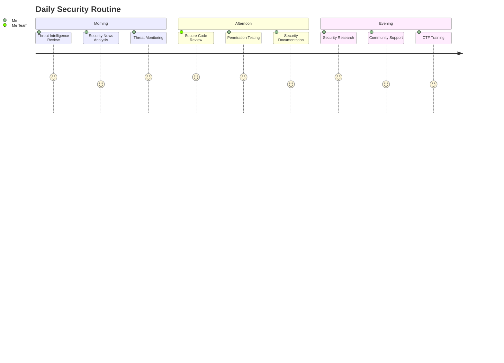
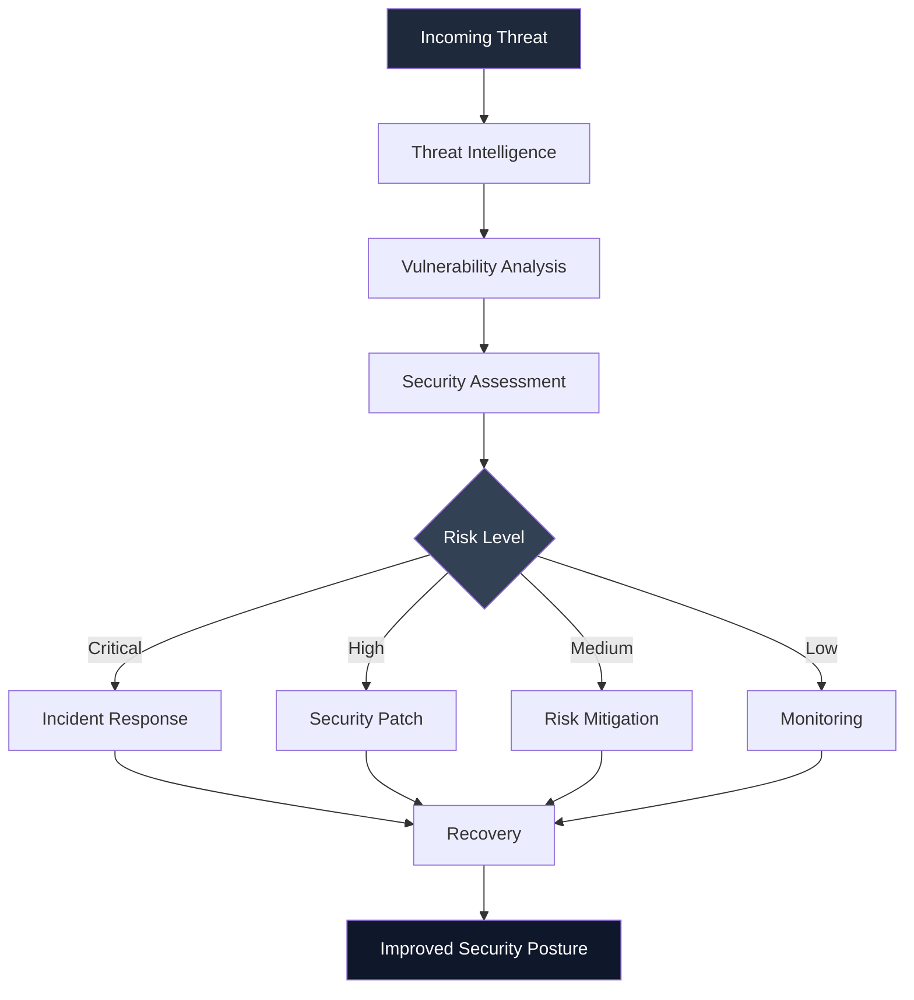
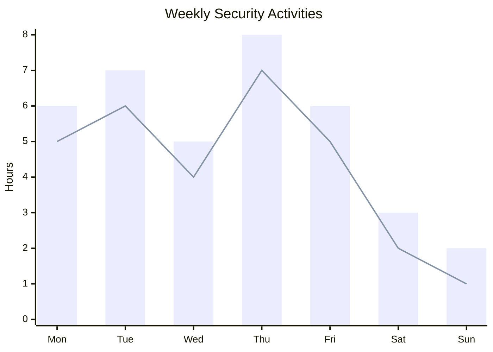
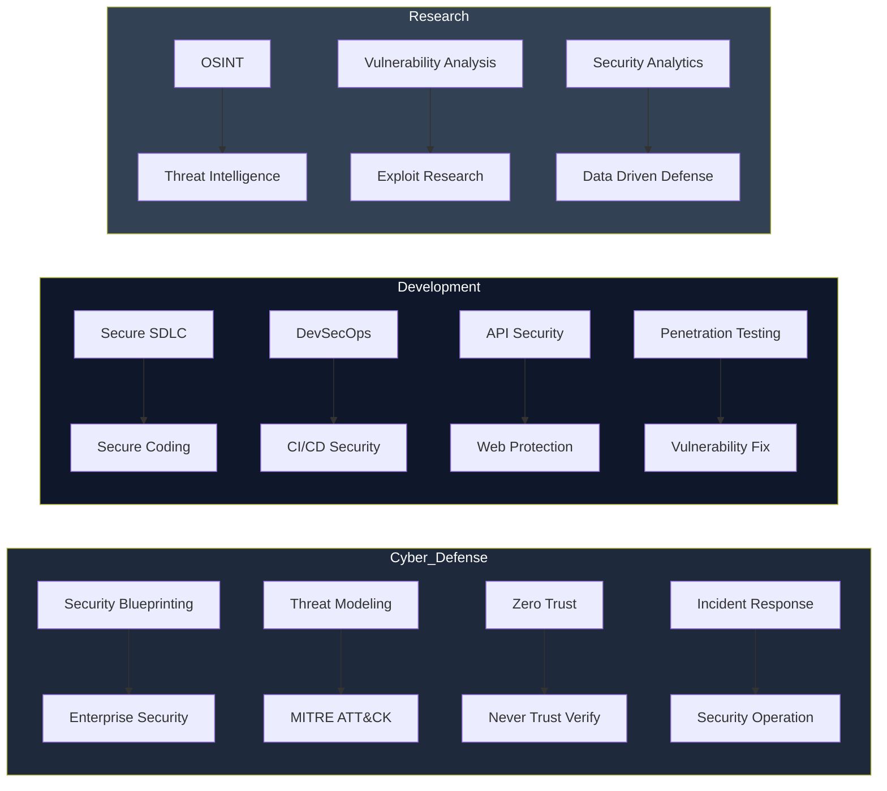
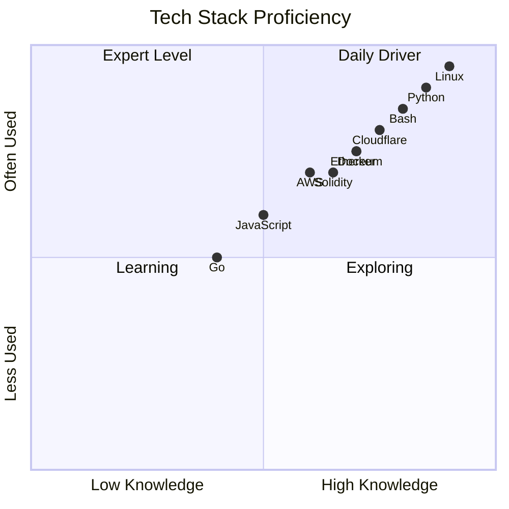
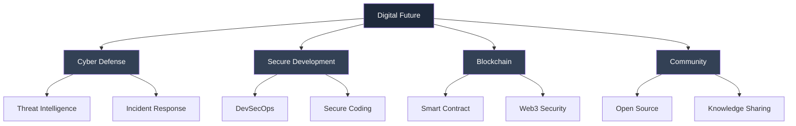

<p align="center">

</p>

<p align="center">


<div align="center">

<h3>
Cyber Defense Architect • Security Engineer • Web3 Builder
</h3>


<br>


</div>


---

<div align="center">

# 👋 About Me

> ### **"Secure by Design. Built for Scale. Trusted by Architecture."**

### Cybersecurity Engineer • Backend Architect • Infrastructure Builder

Designing secure, scalable, and resilient digital platforms with a strong focus on modern backend engineering, payment infrastructure, cloud-native architecture, and offensive security.

---

### 🔥 Core Expertise

🛡 Security Architecture & Threat Modeling

🔐 Ethical Hacking & Penetration Testing

⚙ Backend API & Payment Gateway Development

☁ Cloud Infrastructure & DevSecOps

⛓ Blockchain Security & Crypto Integration

📡 High Availability Systems

🚀 Open Source Engineering

---

<div align="center">
🧬 Security Architecture Map



<div align="center">
🚀 Career Journey



<div align="center">
⏰ Weekly Security Allocation



<div align="center">
  
---

<div align="center">


# 🧠 Cyber Defense Intelligence Map




</div>


---

<div align="center">


# 💻 Daily Security Operation




</div>


---

<div align="center">


# 🚀 Security Workflow




</div>


---

<div align="center">


# 📈 Weekly Security Activity




</div>

---


<div align="center">


# 🛡️ Security Domain Map




</div>


---

<div align="center">


# 📊 Tech Stack Proficiency




</div>


---

<div align="center">


# ⚡ Tech Stack


## 🐧 Operating System


## 💻 Development


## ☁ Cloud


## 🛡 Security Tools


</div>


---

<div align="center">


# 🌍 Digital Ecosystem


<table align="center">


<tr>
<th>Project</th>
<th>Status</th>
<th>Technology</th>
</tr>


<tr>
<td>
<a href="https://kongalicoin.id">
KongaliCoin ID
</a>
</td>

<td>🟢 Active</td>
<td>Ethereum Web3</td>

</tr>


<tr>
<td>
<a href="https://kongalicoin.com">
KongaliCoin COM
</a>
</td>

<td>🟢 Active</td>
<td>Smart Contract</td>

</tr>


<tr>
<td>
<a href="https://younext.cloud">
YOUNEXT Cloud
</a>
</td>

<td>🟢 Active</td>
<td>Cloud Security</td>

</tr>


<tr>
<td>
<a href="https://zlclothindustries.com">
ZLCLOTH Industries
</a>
</td>

<td>🟢 Active</td>
<td>Enterprise System</td>

</tr>


</table>


</div>


---

<div align="center">


# ⛓️ Blockchain Network


```text
Network    : Ethereum Mainnet
Standard   : ERC-20
Ticker     : KAC
Security   : Smart Contract Audited ✓
Consensus  : Proof of Stake
```


</div>


---

<div align="center">


# 📊 GitHub Analytics


</div>


---

<div align="center">


# 🤝 Collaboration


Open Collaboration:


🛡 Cyber Defense Research

🔐 Security Engineering

☁ Cloud Architecture

⛓ Blockchain Security

🚀 Open Source


⚠️ Research dilakukan secara legal dan mengikuti etika profesional.


</div>


---

<div align="center">


# ☕ Support Development


Jika project ini membantu kamu,
support kecil sangat berarti.


<a href="https://www.paypal.com/paypalme/bungtempong99/">


</a>


</div>


---

<div align="center">


# 💛 Human Mode


```text
"Mereka tidak berbeda.

Mereka mengajarkan arti cinta,
ketulusan dan kesabaran."
```


</div>


---

<div align="center">


# 🇮🇩 Gaspol Coding Squad Indonesia


> "Run it, understand it."


Focus:


🐍 Python Project

🛡 Security Tools

⚙ Automation

🏴 CTF Training

🔐 Secure Coding


</div>


---

<div align="center">


⭐ **Think Secure • Build Resilient • Protect Future** ⭐


</div>

<div align="center">


```text
[ SYSTEM STATUS ]

🟢 Cyber Defense Online
🟢 Secure Architecture Active
🟢 Threat Monitoring Active
````


