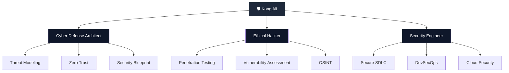
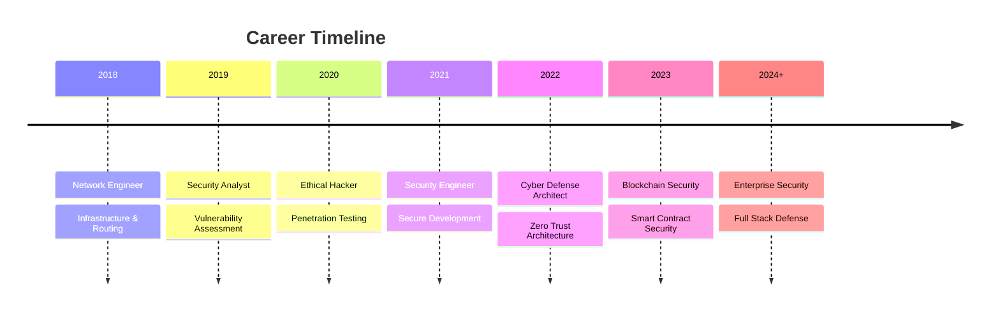
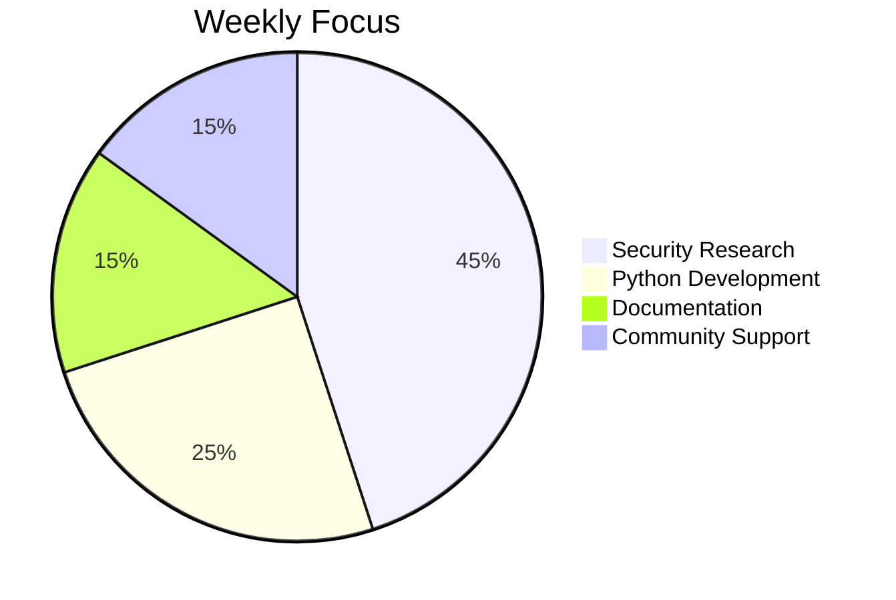
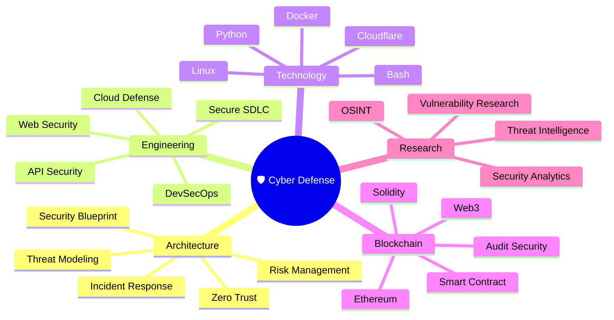
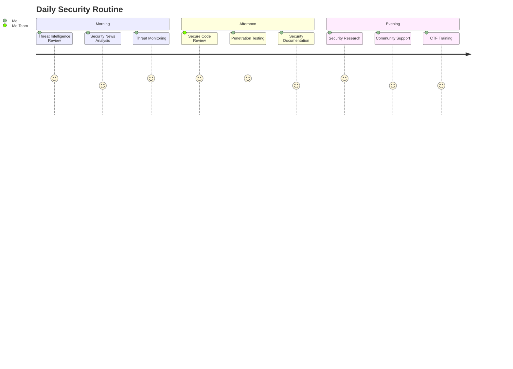
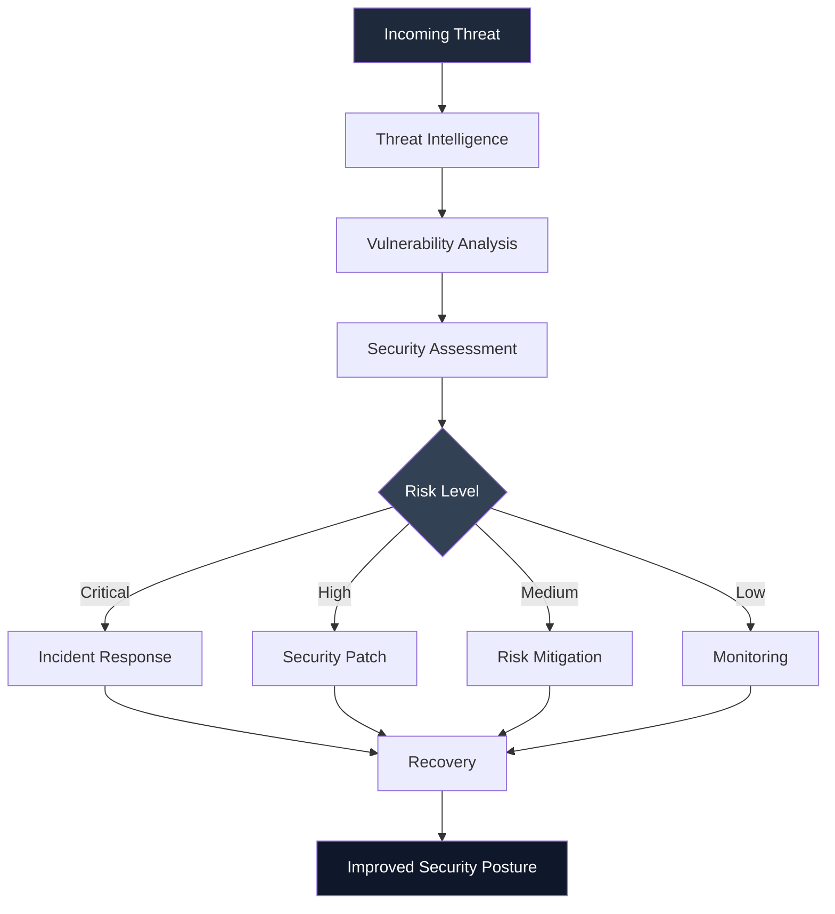
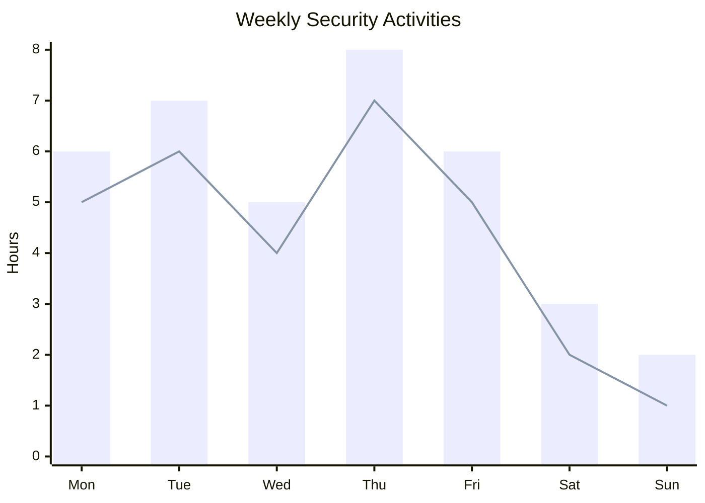
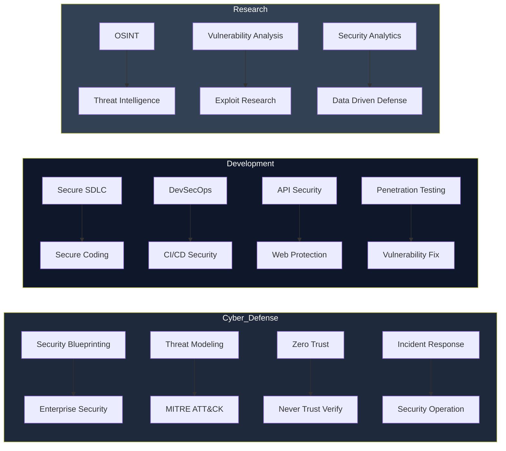
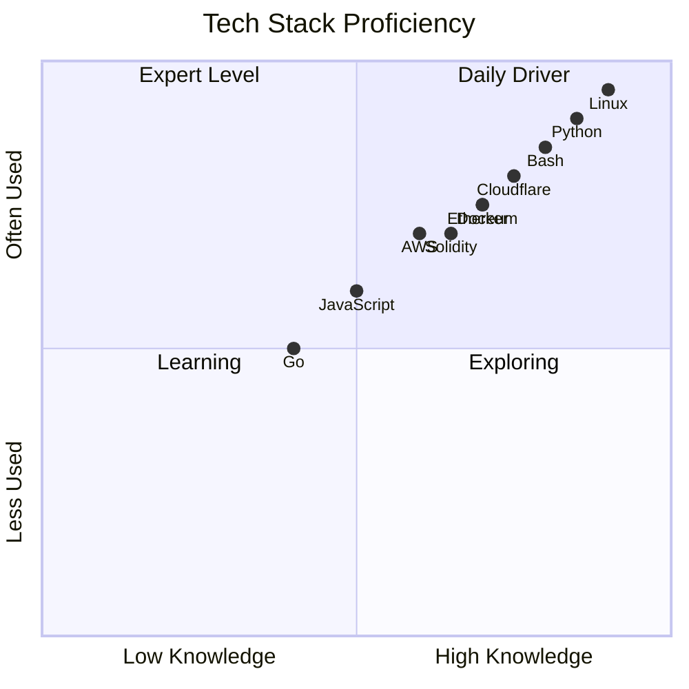

<h3>
Cyber Defense Architect • Security Engineer • Web3 Builder
</h3>

 

---

# 👋 About Me

> ### *"Secure by Design. Built for Scale. Trusted by Architecture."*

### Cybersecurity Engineer • Backend Architect • Infrastructure Builder

Designing secure, scalable, and resilient digital platforms with a strong focus on modern backend engineering, payment infrastructure, cloud-native architecture, and offensive security.

---

### 🔥 Core Competencies

| Domain | Specialization |
|--------|----------------|
| 🛡️ **Security Engineering** | Security Architecture, Threat Modeling, Zero Trust Implementation, Security Audits |
| 🔐 **Offensive Security** | Ethical Hacking, Penetration Testing, Vulnerability Assessment, Red Teaming |
| ⚙️ **Backend Engineering** | API Development, Microservices, Payment Gateway Integration, Distributed Systems |
| ☁️ **Cloud & DevSecOps** | AWS/GCP/Azure, Kubernetes, Docker, CI/CD Pipelines, Infrastructure as Code |
| ⛓️ **Blockchain & Web3** | Smart Contract Security, Crypto Integration, DeFi Security, Wallet Engineering |
| 📡 **Systems Engineering** | High-Availability Architecture, Performance Optimization, Site Reliability Engineering |
| 🚀 **Open Source** | Community Leadership, Technical Documentation, OSS Contribution & Maintenance |

---

## 🧭 Security Philosophy

| Principle | Description |
|-----------|-------------|
| 🔒 **Proactive Defense** | Anticipating threats before they materialize. |
| 🏗️ **Architectural Excellence** | Designing systems for resilience, scalability, and long-term evolution. |
| 🤝 **Collaborative Security** | Integrating development, operations, and security into a unified workflow. |
| 📈 **Continuous Improvement** | Continuously learning, adapting, and improving security capabilities. |

---

### 🛠️ Technical Arsenal

#### Security Stack
`Python` `Bash` `PowerShell` `YARA` `Metasploit` `Burp Suite` `Nmap` `Wireshark` `Snort` `Suricata`

#### Backend & Infrastructure
`Go` `Rust` `Node.js` `Java` `PostgreSQL` `Redis` `Kafka` `Docker` `Kubernetes` `Terraform` `Ansible`

#### Cloud Platforms
`AWS` `GCP` `Azure` `DigitalOcean` `Linode` `Cloudflare`

#### Blockchain & Web3
`Solidity` `Rust` `Ethereum` `Solana` `Hardhat` `Foundry` `Web3.js` `Ethers.js`

---

### 📊 Professional Impact

| Metric | Achievement |
|--------|-------------|
| 🔒 **Systems Secured** | 50+ Production Environments |
| 💳 **Payment Volume** | $100M+ Annual Transaction Value |
| 🏗️ **Architecture Projects** | 20+ Enterprise-Grade Systems |
| 🐛 **Vulnerabilities Found** | 200+ Responsible Disclosures |
| 📚 **Documentation Written** | 1000+ Pages of Technical Guides |
| 🌍 **Community Reach** | 10,000+ Developers Worldwide |

---

## 🌟 Selected Achievements

| Achievement | Impact |
|------------|--------|
| 🏆 **High-Availability Infrastructure** | Designed and implemented resilient payment infrastructure with a strong focus on scalability and high availability. |
| 🔐 **Security Architecture** | Led security architecture improvements for fintech platforms to strengthen defense and reduce security risks. |
| 📖 **Security Frameworks** | Developed practical security frameworks, playbooks, and automation guides for defensive security operations. |
| 🤖 **AI Security Automation** | Built AI-assisted security automation tools to accelerate threat analysis and incident response workflows. |
| ⛓️ **Web3 Security** | Designed and reviewed blockchain security architectures, smart contract workflows, and Web3 infrastructure. |
| 🚀 **Open Source** | Contributed to open-source cybersecurity projects focused on automation, defensive security, and AI integration. |

---

### 📫 Connect With Me

---

## 📬 Let's Collaborate

I'm always open to collaborating on projects that advance cybersecurity, AI, and open-source innovation.

| Area | Focus |
|------|-------|
| 🚀 **Security Research** | Threat research, vulnerability analysis, and defensive security engineering. |
| 🏗️ **Architecture Reviews** | Security architecture, system design, and infrastructure resilience. |
| 🔬 **Open Source** | Cybersecurity, automation, DevSecOps, and cloud-native projects. |
| 📝 **Technical Writing** | Documentation, security playbooks, tutorials, and knowledge sharing. |
| 🤝 **Community Building** | Mentorship, developer communities, conferences, and collaborative initiatives. |

**Open for:** Security Consultancy • Architecture Reviews • Technical Advisory • Speaking Engagements • Open Source Collaboration

---

### 🏅 Certifications & Recognition

| Certification | Issuer |
|---------------|--------|
| CEH (Certified Ethical Hacker) | EC-Council |
| OSCP (Offensive Security Certified Professional) | Offensive Security |
| CISSP (Certified Information Systems Security Professional) | ISC² |
| AWS Certified Security - Specialty | Amazon Web Services |
| Certified Kubernetes Security Specialist | CNCF |

---

## 🛡️ Building Secure Systems for the Future

*Cybersecurity • AI Security • Security Automation • Open Source*

⭐ **If you find this project useful, consider giving it a Star and contributing to the community.**

🧬 Security Architecture Map

     
🚀 Career Journey

     
⏰ Weekly Security Allocation

  
---

# 🧠 Cyber Defense Intelligence Map

---

# 💻 Daily Security Operation

---

# 🚀 Security Workflow

---

# 📈 Weekly Security Activity

---

# 🛡️ Security Domain Map

---

# 📊 Tech Stack Proficiency

---

## ⚡ Technology Stack

| Layer | Technologies |
|--------|--------------|
| 🐧 Operating Systems | Linux, Ubuntu Server, Kali Linux |
| 💻 Programming | Python, Bash, Go, JavaScript |
| ☁️ Cloud & Infrastructure | AWS, Docker, Cloudflare |
| 🛡️ Security | Wireshark, Nmap, Burp Suite, YARA |
| 🤖 AI & Automation | Groq, Gemini, OpenAI, n8n |
| 🔐 DevSecOps | GitHub Actions, Git, CI/CD |
---

## 🌐 Project Ecosystem

| Project | Description | Status |
|----------|-------------|:------:|
| **KongaliCoin ID** | Web3 ecosystem and blockchain platform | 🟢 Active |
| **KongaliCoin** | ERC-20 smart contract ecosystem | 🟢 Active |
| **YOUNEXT Cloud** | Cloud infrastructure and security platform | 🟢 Active |
| **ZLCLOTH Industries** | Enterprise digital solutions | 🟢 Active |

---

## ☕ Support the Project

If this project has helped your research, learning, or security operations, consider supporting its continued development.

---

